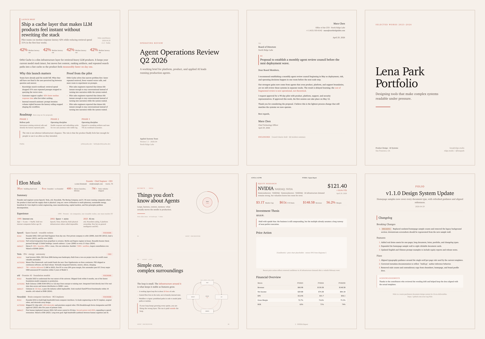
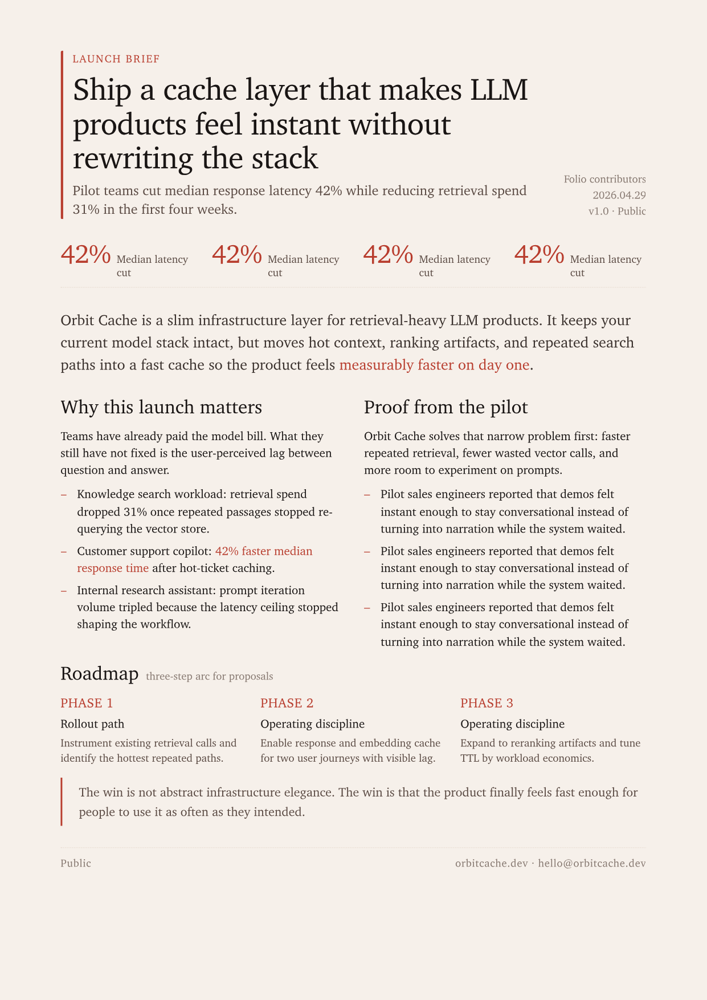
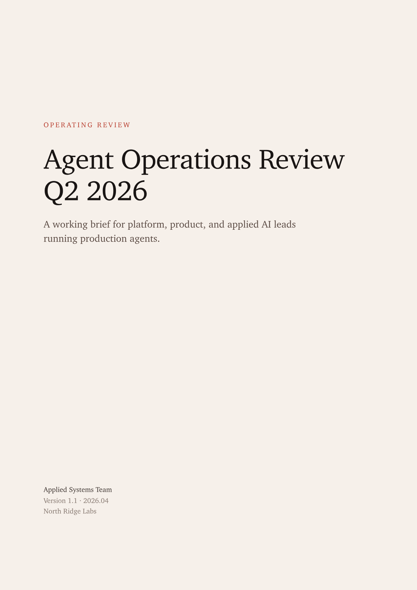
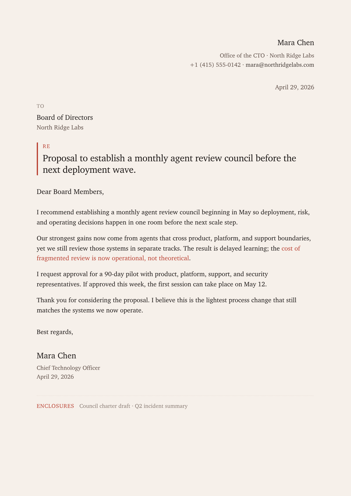
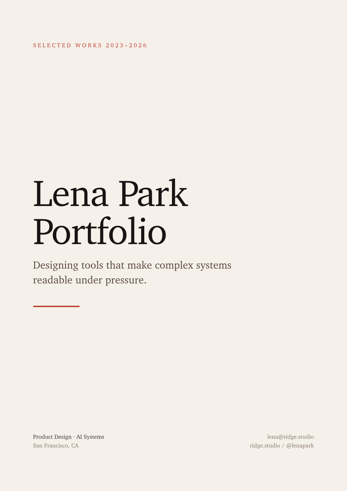
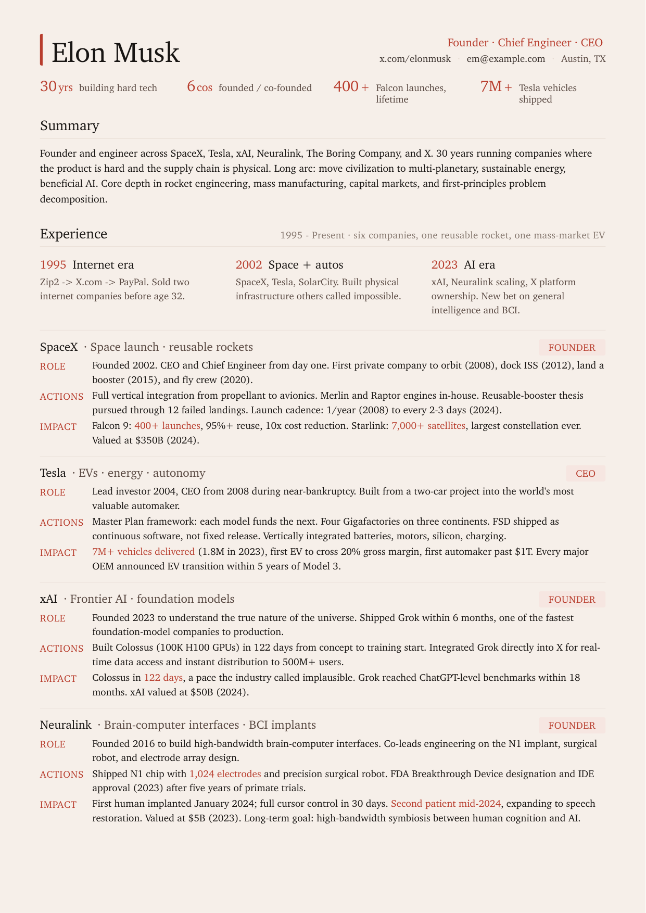
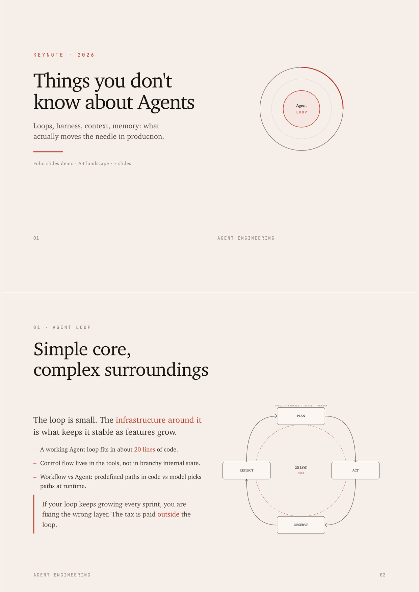
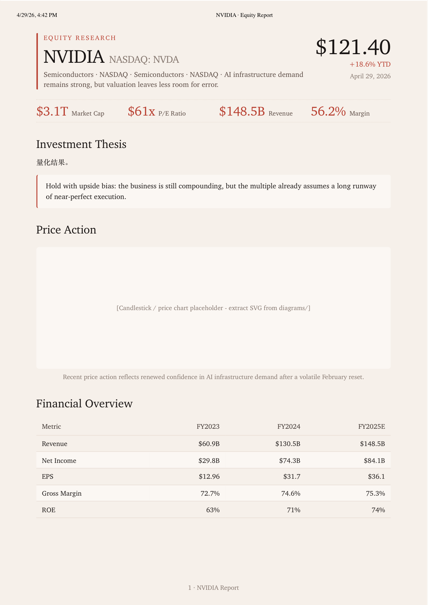
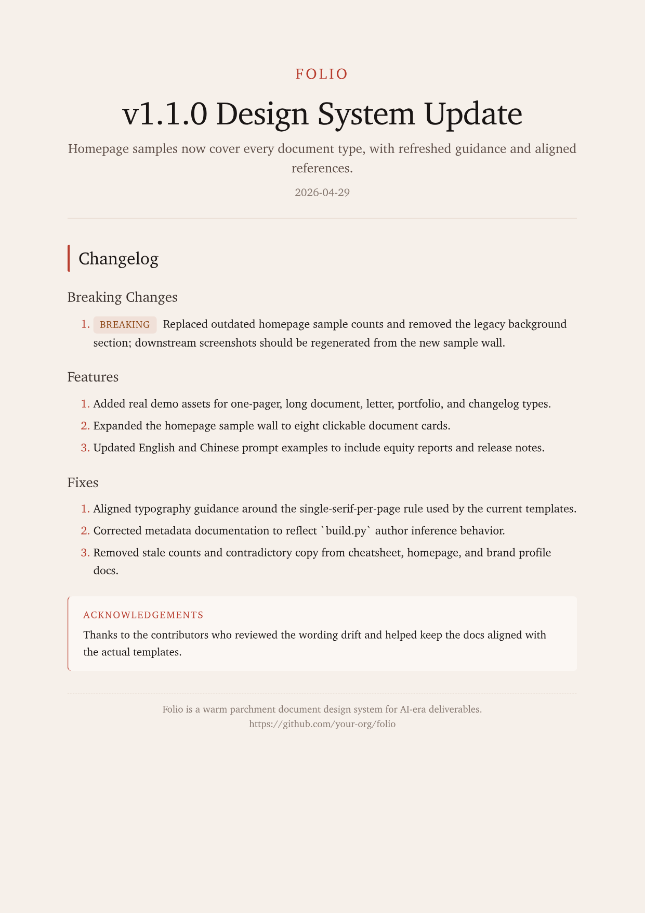

  
  <h1>Folio</h1>
  
<b>For documents worth keeping.</b>

  
<a href="README.zh-CN.md">简体中文</a>

  
Folio is forked from <a href="https://github.com/tw93/Kami">Kami</a> and extended into a document-first design system for agent-generated deliverables.

  

  

  <a href="index-en.html"><b>Visual Gallery</b></a> ·
  <a href="assets/demos/"><b>All Demos</b></a> ·
  <a href="README.zh-CN.md"><b>中文说明</b></a>

## See Folio First

Folio is a document design system for the AI era: eight document types, fourteen inline SVG diagram types, and bilingual English/Chinese paths built for agent-generated deliverables.

It optimizes for stable, readable, professional output rather than novelty.

What matters on first contact:

- eight document types, each with a stable editorial layout
- bilingual English and Chinese generation paths
- PDF- and PPTX-oriented outputs instead of generic HTML mockups
- visual consistency across one-pagers, reports, decks, resumes, and release notes

## Document Gallery

<table>
  <tr>
    <td width="50%" valign="top">
       
      <b>One-Pager</b> 
      Launch brief, proposal, exec summary.
    </td>
    <td width="50%" valign="top">
       
      <b>Long Doc</b> 
      White paper, review, technical report.
    </td>
  </tr>
  <tr>
    <td width="50%" valign="top">
       
      <b>Letter</b> 
      Formal letter, memo, statement.
    </td>
    <td width="50%" valign="top">
       
      <b>Portfolio</b> 
      Case studies, selected works.
    </td>
  </tr>
  <tr>
    <td width="50%" valign="top">
       
      <b>Resume</b> 
      Professional resume and CV.
    </td>
    <td width="50%" valign="top">
       
      <b>Slides</b> 
      Talk deck, keynote, internal presentation.
    </td>
  </tr>
  <tr>
    <td width="50%" valign="top">
       
      <b>Equity Report</b> 
      Investment memo, earnings brief.
    </td>
    <td width="50%" valign="top">
       
      <b>Changelog</b> 
      Release notes, version update.
    </td>
  </tr>
</table>

## From Prompt To Output

1. Start with raw notes, a draft, source links, or a loose request like `make a one-pager for my startup`.
2. Folio routes the request to the right document type and language path, then reshapes the content into a template-ready structure.
3. The output lands as a stable PDF or PPTX with Folio's parchment canvas, serif hierarchy, and restrained cinnabar-coral accent.

## Quick Start

**Claude Desktop**

Build or copy `dist/folio.zip`, open Customize > Skills > "+" > Create skill, and upload the ZIP directly.

**Generic agents** (Codex, OpenCode, Pi, and other tools that read from `~/.agents/`)

Use the packaged ZIP for a local install now, or publish this repository under your own namespace and install from that destination later.

Folio auto-triggers from natural requests. Tell it:

- which document type you want
- which language to use
- the raw content, notes, or draft to work from
- any current facts or source links that must be preserved
- any brand assets that matter: logo, screenshot, product image, brand color
- any output expectation that changes the default: PDF, PPTX, PNG, public draft, internal memo

Example prompts:

- `make a one-pager for my startup`
- `turn this research into a long doc`
- `write a formal letter`
- `make a portfolio of my projects`
- `build me a resume`
- `design a slide deck for my talk`
- `write an equity report on NVIDIA`
- `format these release notes`

Optional: create `~/.config/folio/brand.md` to persist identity, document defaults, and writing habits. Start from [brand.example.md](references/brand.example.md). Folio uses it as fallback context when the current request is ambiguous.

Templates live in `assets/templates/`. Rendered showcase assets in `assets/demos/` are kept as `PDF + PNG`, so README can stay visual without trying to recreate the full homepage inside Markdown.

## Core Capabilities

### Type routing

Folio routes requests across eight document types and two language paths.

- Chinese requests route to `*.html` or `slides.py`
- English requests route to `*-en.html` or `slides-en.py`
- Slides are generated from Python, not HTML

### Content distillation

Folio can turn raw notes into structured documents instead of requiring a clean outline first.

- Meeting notes, dumps, transcripts, and scattered bullets can be distilled into template-ready sections
- Resume and portfolio content is tightened toward measurable outcomes
- Equity reports and changelogs are pushed toward evidence-first writing

### Source and material checks

Folio treats current facts and branded assets as first-class inputs.

- For current facts, it expects reliable sources before writing
- For branded documents, it checks whether logo, screenshot, product image, and brand color are available
- If critical material is missing, the gap stays explicit instead of being filled with generic visuals

### Output generation

Folio supports two main output paths:

- HTML templates -> PDF
- Python slide templates -> PPTX

Showcase demos usually keep `HTML + PDF + PNG` together so the homepage and README stay truthful.

### Cheatsheet-driven editing

Folio also carries a compact operating reference in [CHEATSHEET.md](CHEATSHEET.md).

- Use it for the shortest path to tokens, type scale, spacing, chart limits, and common CSS patterns
- Use `references/design.md` when you need the full visual system
- Use `references/writing.md` when structure is fine but content quality is weak
- Use `references/production.md` when builds, page counts, or render behavior go wrong

## Layout Rules

These are the minimum rules that matter most.

1. Page background stays parchment `#F6F0EA`, never pure white.
2. Use one accent only: cinnabar-coral `#B83D2E`.
3. One serif per page by default; do not introduce a second visual language unless the template already does.
4. Serif body stays at 400, headings at 500. Avoid synthetic bold.
5. Chinese print body usually carries light tracking; English body stays at 0.
6. Tag backgrounds must use solid hex values. Do not use `rgba()` because WeasyPrint can render a double rectangle.
7. Depth comes from ring shadow, whisper shadow, or light/dark alternation. No hard drop shadows.
8. Respect the page-count contract for each document type, especially resume and one-pager.

## Design References

Use the short guide first, then go deeper only when needed.

- [CHEATSHEET.md](CHEATSHEET.md): fast reference
- [references/design.md](references/design.md): visual system
- [references/writing.md](references/writing.md): content strategy and quality bars
- [references/production.md](references/production.md): build, verification, and troubleshooting
- [references/diagrams.md](references/diagrams.md): inline SVG diagram rules

## Travel / Image Prompting

Folio also works as a brief for image models and drawing tools. Point them at the `references/` folder and ask them to follow Folio's warm parchment palette, cinnabar-coral restraint, serif-led hierarchy, and editorial spacing.

Example illustration briefs:

<table>
  <tr>
    <td width="33.33%" valign="top" align="center">
       
      Alpine night-train travel atlas with station callouts, timetable chips, and warm editorial annotations
    </td>
    <td width="33.33%" valign="top" align="center">
       
      Coastal weekend route poster with tide windows, cafe stops, and hand-marked walking segments
    </td>
    <td width="33.33%" valign="top" align="center">
       
      Desert design hotel field guide with arrival map, packing cues, and restrained artifact photography framing
    </td>
  </tr>
</table>

## Support

- Open an issue or PR if you find a bug, wording drift, or layout regression.
- MIT License for code and templates.
- LXGW WenKai is open-source. Charter fallbacks rely on system or open-licensed availability.
