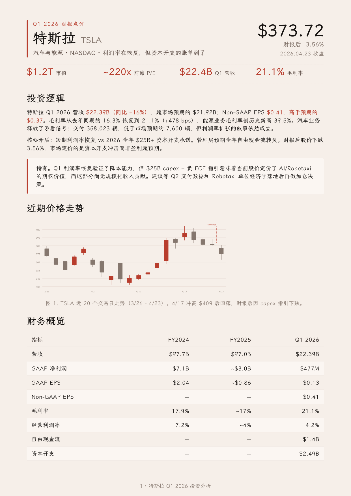

<div align="center">
  
  <h1>Folio</h1>
  <p><b>Good content deserves good paper.</b></p>
  <a href="LICENSE"></a>
</div>

## Why

Folio is the surface where a finished idea lands. AI-generated documents keep drifting into generic gray, inconsistent styling, and layouts that change every session.

Folio is a document design system for the AI era: one constraint language, eight formats, simple enough for agents to run reliably, strict enough to keep every output coherent and ready to ship. English and Chinese are first-class.

## See it

<table>
<tr>
  <td align="center" width="25%">
    <a href="assets/demos/demo-tesla.pdf"></a>
    <br><b>One-Pager</b> · 中文
    <br><sub>Tesla 公司介绍 · 单页</sub>
  </td>
  <td align="center" width="25%">
    <a href="assets/demos/demo-agent-slides.pdf"></a>
    <br><b>Slides</b> · English
    <br><sub>Agent keynote, 6 slides</sub>
  </td>
  <td align="center" width="25%">
    <a href="assets/demos/demo-musk-resume.pdf"></a>
    <br><b>Resume</b> · English
    <br><sub>Founder CV, 2 pages</sub>
  </td>
</tr>
</table>

## Usage

**Claude Code**

```bash
# Publish this repository under your own namespace first.
# Then install Folio from that destination.
```

**Generic agents** (Codex, OpenCode, Pi, and other tools that read from `~/.agents/`)

```bash
# Repository install commands depend on your final namespace.
# Use the packaged ZIP below if you want a local install now.
```

**Claude Desktop**

Build or copy `dist/folio.zip`, open Customize > Skills > "+" > Create skill, and upload the ZIP directly (no need to unzip).

The ZIP is lightweight: Chinese fonts load from local checkout first, then the official GitHub source if needed. If rendering is off, Claude downloads them on the next run. To update: download the same URL, click "..." on the skill card, choose Replace, upload.

The skill auto-triggers from natural requests, no slash command needed. Optimized for English and Chinese.

Example prompts by language:

- English: `make a one-pager for my startup` / `turn this research into a long doc` / `write a formal letter` / `make a portfolio of my projects` / `build me a resume` / `design a slide deck for my talk`
- 中文: `帮我做一份一页纸` / `帮我排版一份长文档` / `帮我写一封正式信件` / `帮我做一份作品集` / `帮我做一份简历` / `帮我做一套演讲幻灯片`
**Optional: brand profile**

Create `~/.config/folio/brand.md` to persist identity, brand, defaults, and writing habits. See [brand.example.md](references/brand.example.md) for a full template.

The file has YAML frontmatter (structured fields: name, role, email, website, GitHub, brand color, language, page size, currency locale, tone, and more) plus a Markdown body for freeform notes. Folio treats it as the lowest-resolution context: applied only when the current request is ambiguous, and always overridable by what the specific document needs. The goal is to feel familiar across your work without making every output look the same.

## Design

Warm parchment canvas, cinnabar-coral as the sole accent, serif carries hierarchy, no hard shadows or flashy palettes. Not a UI framework; a constraint system for printed matter. Documents should read as composed pages, not dashboards.

Eight document types (One-Pager, Long Doc, Letter, Portfolio, Resume, Slides, Equity Report, Changelog) with dedicated EN/CN templates. Fourteen inline SVG diagram types included. Folio picks the right variant based on the language you write in.

| Element | Rule |
|---|---|
| Canvas | `#F6F0EA` parchment, never pure white |
| Accent | Cinnabar-coral `#B83D2E` only, no second chromatic hue |
| Neutrals | All warm-toned (yellow-brown undertone), no cool blue-grays |
| Serif | Body 400, headings 500. Avoid synthetic bold |
| Line-height | Tight titles 1.1-1.3, dense body 1.4-1.45, reading body 1.5-1.55 |
| Shadows | Ring or whisper only, no hard drop shadows |
| Tags | Solid hex backgrounds only. `rgba()` triggers a WeasyPrint double-rectangle bug |

**Fonts**: Each language uses a single serif font for the entire page. Chinese: LXGW WenKai / 霞鹜文楷. English: Charter. LXGW WenKai is open-source and available from the [official GitHub repository](https://github.com/lxgw/LxgwWenKai). All other fallbacks are system-bundled.

Full spec: [design.md](references/design.md). Cheatsheet: [CHEATSHEET.md](CHEATSHEET.md).

## Travel

The same constraint system doubles as a brief you can hand to any drawing tool. Point it at the [references folder](references/) and the output inherits warm parchment, cinnabar-coral restraint, single-line geometric icons, and editorial typography.

> Apply the Folio design system from `./references`

<table>
<tr>
  <td align="center" width="33%">
    
    <br><b>Evidence layout</b> · 中文
    <br><sub>Tesla Optimus 手部和前臂专利图一览</sub>
  </td>
  <td align="center" width="33%">
    
    <br><b>Architecture redraw</b> · English
    <br><sub>SpatialVLA Figure 1, schematic</sub>
  </td>
  <td align="center" width="33%">
    
    <br><b>Concept tradeoff</b> · 中文
    <br><sub>3D 表示的算力-推理性取舍</sub>
  </td>
</tr>
</table>

<sub>Rendered by ChatGPT Images 2.0 in a single pass with no manual touch-up. Folio specifies, the renderer draws.</sub>

## Background

I like investing in US equities and ask Claude to write research reports all the time. Every output landed in the same default-doc look: gray, flat, a different layout each session. The structure was hard to scan, the formatting felt dated, and nothing about the page made me want to keep reading. So I started fixing the typography, the palette, the spacing, one rule at a time, until the report became a page I actually enjoyed.

Later I needed to present "The Agent You Don't Know: Principles, Architecture and Engineering Practice." I already had the document and didn't want to build slides from scratch, so I used Claude Design to lay it out in my own style, tweaked it round after round, and eventually got it to a place I was happy with. That process added inline SVG charts, a unified warm palette, and a tighter editorial rhythm. It kept growing until it covered every document I regularly ship, so I kept abstracting the process, and it became Folio: one quiet design system I can hand to any agent and trust the output.

## Support

- Got ideas or bugs? Open an issue or PR.

## License

MIT License for Folio code and templates. Feel free to use and contribute.

**Fonts**: LXGW WenKai (Chinese) is open-source. Charter (English) and CJK fallbacks are system-bundled or open-licensed.
