<div align="center">
  
  <h1>Folio</h1>
  <p><b>值得留存的文档版式。</b></p>
  <p><sub>Folio fork 自 <a href="https://github.com/tw93/Kami">Kami</a>，并在此基础上扩展成一套面向 agent 生成交付物的文档设计系统。</sub></p>
  <a href="LICENSE"></a>
</div>

<p align="center">
  <a href="index-zh.html">
    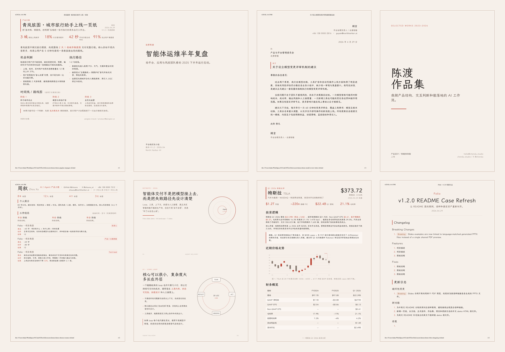
  </a>
</p>

<p align="center">
  <a href="index-zh.html"><b>视觉展厅</b></a> ·
  <a href="assets/demos/"><b>全部案例</b></a> ·
  <a href="README.md"><b>English</b></a>
</p>

## 先看效果，再看说明

Folio 是一套面向 AI 时代的文档设计系统：覆盖 8 种文档类型、14 种内联 SVG 图表类型、2 种可独立导出的图形 artifact，中英文两条生成路径，并提供面向阅读页面和产品工作台的 Web 设计指导，专门服务于 agent 驱动的交付物。

它追求的不是视觉花样，而是稳定、清晰、专业、可重复的输出结果。

Folio 不把文档视为中性的输出，而把它看作思想获得公共形体、可读性与留存性的方式。暖米纸底让页面慢下来，serif 让判断有声音，朱砂色标出真正重要之处，留白则保护读者的注意力。

完整项目文本见英文版 [references/manifesto.md](references/manifesto.md) 与中文版 [MANIFESTO.zh-CN.md](MANIFESTO.zh-CN.md)。

第一次打开仓库，最值得先感受到的是：

- 同一套设计语言如何覆盖 8 种文档类型
- 架构图和 UML 类图如何作为独立 artifact 输出 `SVG + PNG + PDF`
- 中文和英文输出如何共享一致的排版气质
- Web 设计指导如何覆盖阅读页面和产品工作台，而不把 Folio 变成前端框架
- 成品默认落到 PDF / PPTX，而不是停留在 HTML 示意图
- 一页纸、研报、简历、幻灯片、更新日志之间如何保持统一而不单调

## 文档样本墙

<table>
  <tr>
    <td width="50%" valign="top">
      <a href="assets/demos/demo-qinglan-onepager-zh.pdf">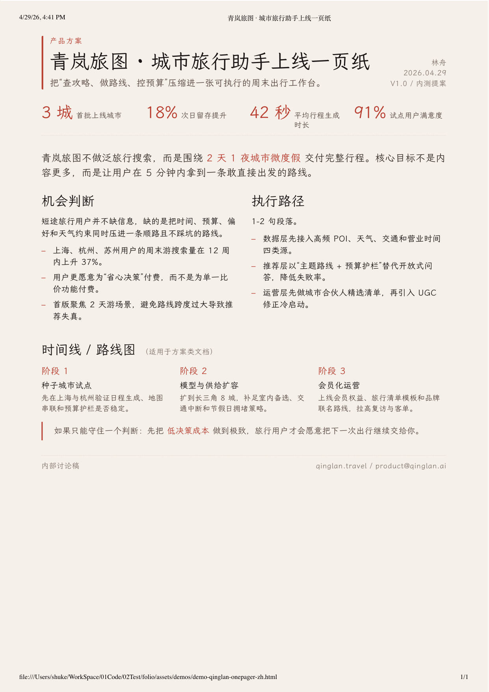</a><br>
      <b>One-Pager</b><br>
      上线简介、提案、执行摘要。
    </td>
    <td width="50%" valign="top">
      <a href="assets/demos/demo-agent-ops-longdoc-zh.pdf">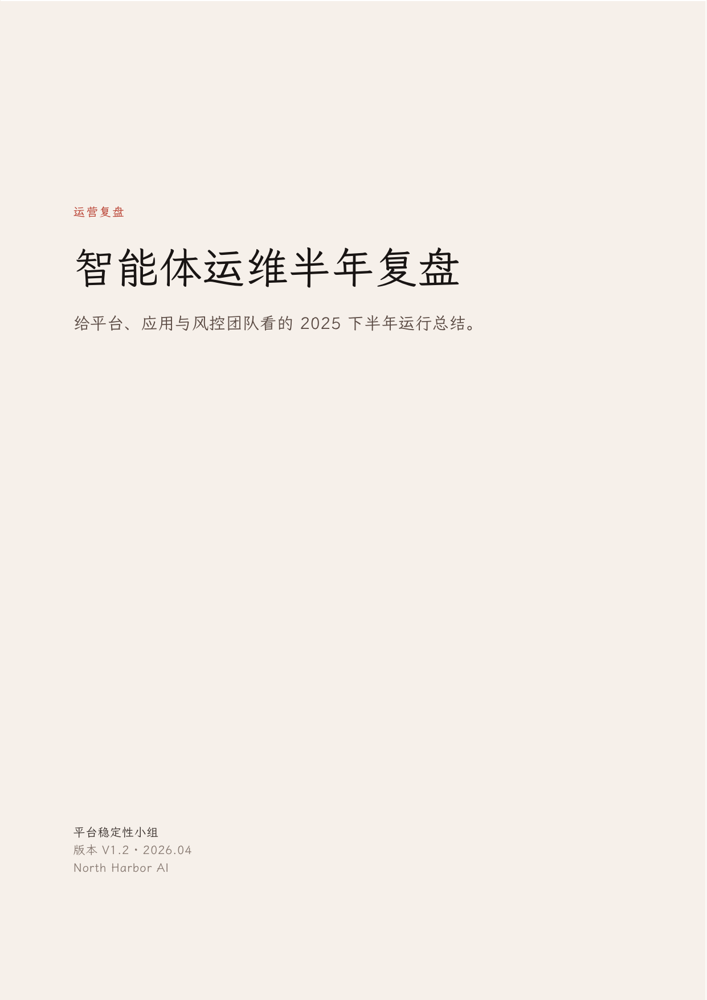</a><br>
      <b>Long Doc</b><br>
      白皮书、复盘、技术报告。
    </td>
  </tr>
  <tr>
    <td width="50%" valign="top">
      <a href="assets/demos/demo-model-review-letter-zh.pdf">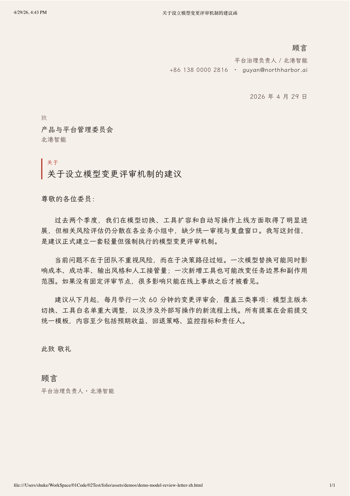</a><br>
      <b>Letter</b><br>
      正式信件、备忘录、声明。
    </td>
    <td width="50%" valign="top">
      <a href="assets/demos/demo-chendu-portfolio-zh.pdf">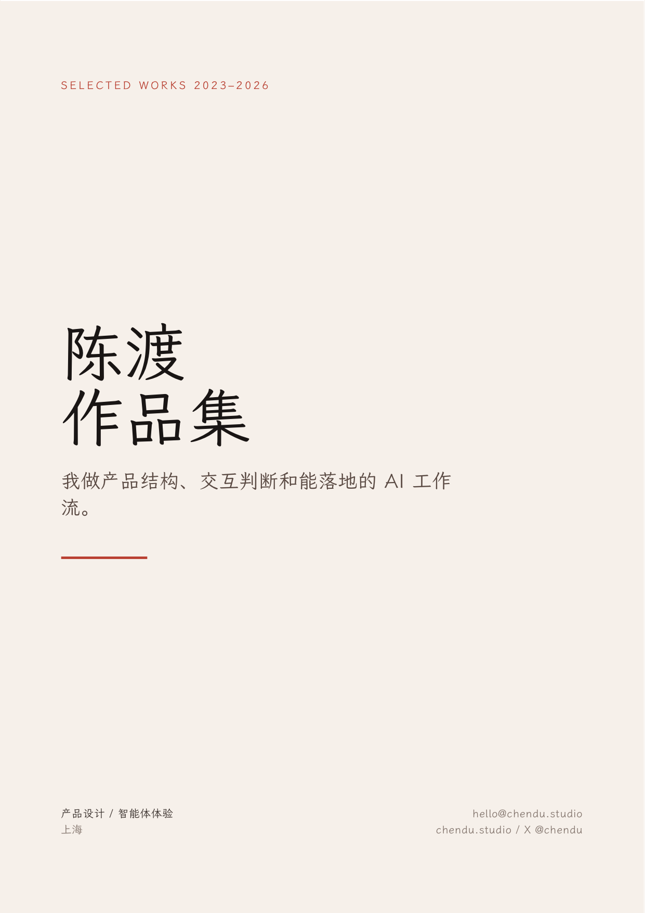</a><br>
      <b>Portfolio</b><br>
      作品集、案例集、精选项目。
    </td>
  </tr>
  <tr>
    <td width="50%" valign="top">
      <a href="assets/demos/demo-zhouxu-resume-zh.pdf">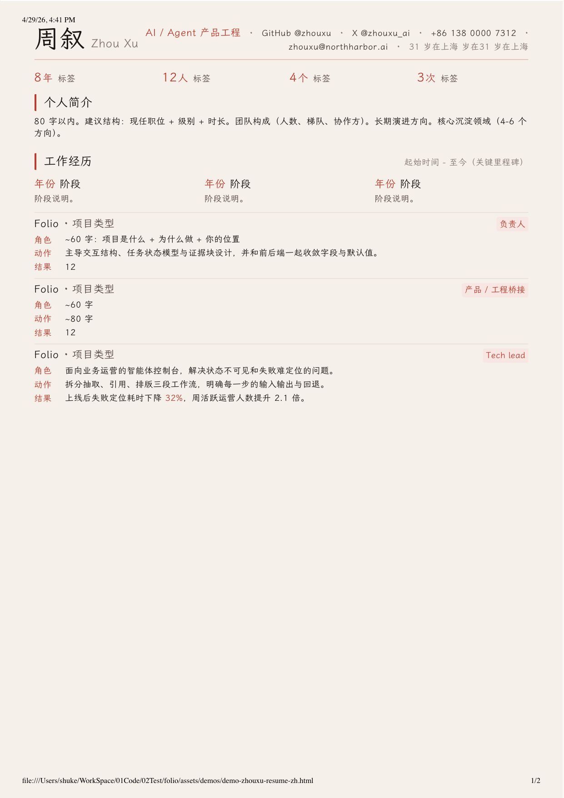</a><br>
      <b>Resume</b><br>
      简历、职业履历。
    </td>
    <td width="50%" valign="top">
      <a href="assets/demos/demo-agent-slides-zh.pdf">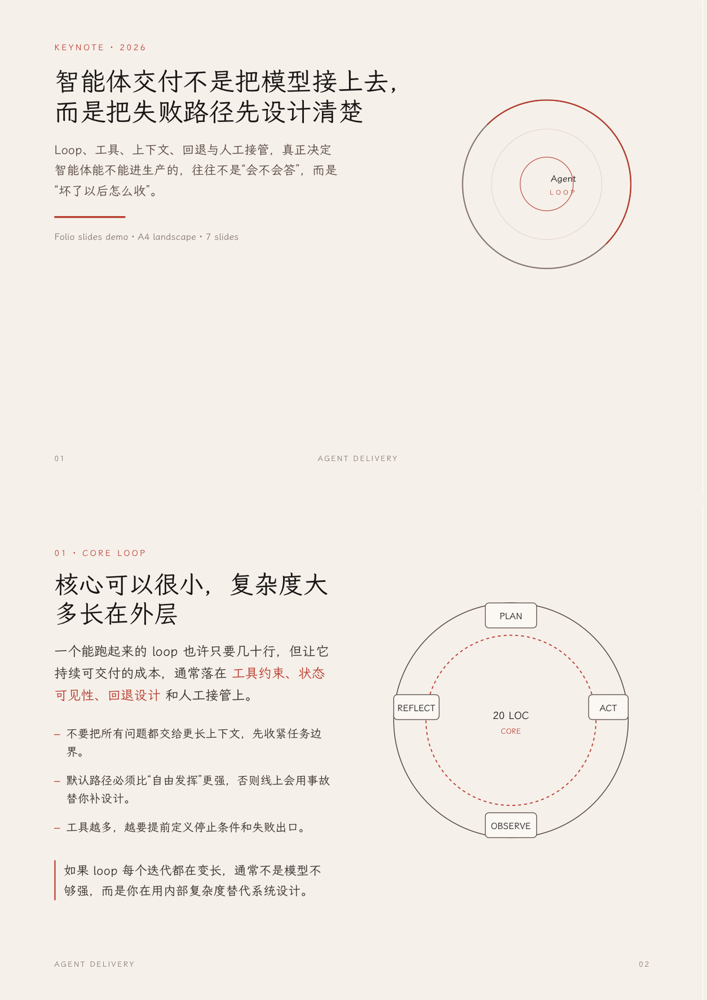</a><br>
      <b>Slides</b><br>
      演讲稿、Keynote、内部汇报。
    </td>
  </tr>
  <tr>
    <td width="50%" valign="top">
      <a href="assets/demos/demo-tesla.pdf"></a><br>
      <b>Equity Report</b><br>
      投资备忘录、财报快报、个股研报。
    </td>
    <td width="50%" valign="top">
      <a href="assets/demos/demo-folio-changelog-zh.pdf">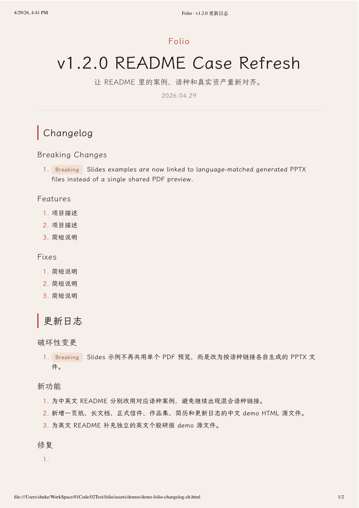</a><br>
      <b>Changelog</b><br>
      更新日志、版本说明、Release Notes。
    </td>
  </tr>
</table>

## 图形 Artifact 案例

<table>
  <tr>
    <td width="33.33%" valign="top">
      <a href="assets/demos/demo-architecture.pdf">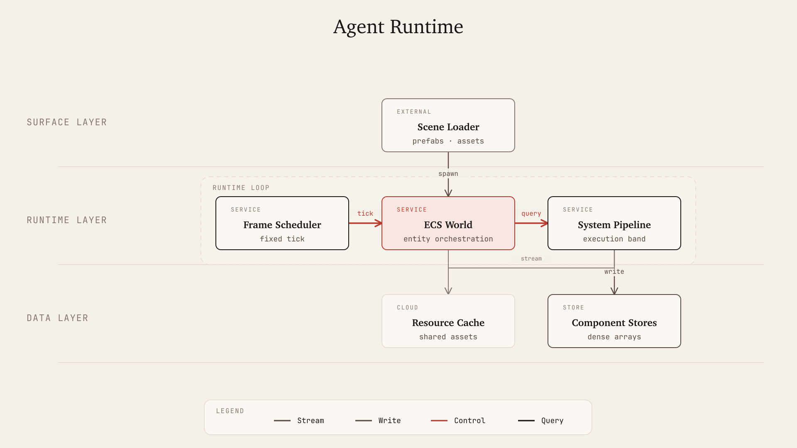</a><br>
      <b>Agent Runtime</b><br>
      请求驱动运行时案例：覆盖网关入口、任务规划、模型执行、工具调用、检索内存和可观测性。
    </td>
    <td width="33.33%" valign="top">
      <a href="assets/demos/demo-workflow-engine.pdf">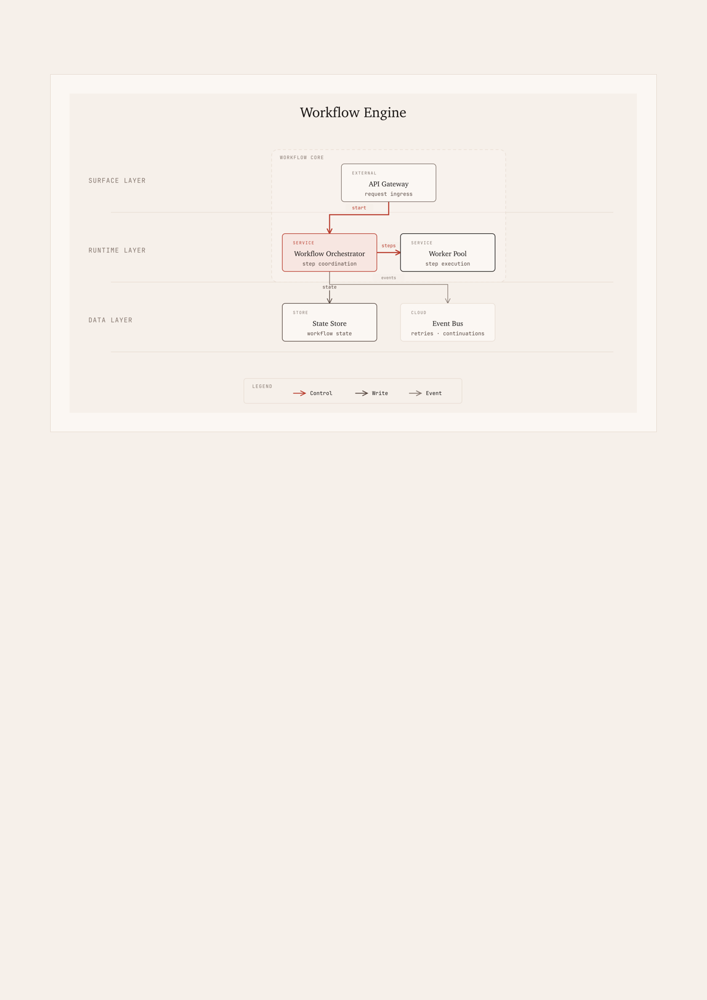</a><br>
      <b>Workflow Engine</b><br>
      工作流编排案例：覆盖入口接入、流程编排、Worker 执行、状态持久化和事件式延续。
    </td>
    <td width="33.33%" valign="top">
      <a href="assets/demos/demo-data-platform.pdf">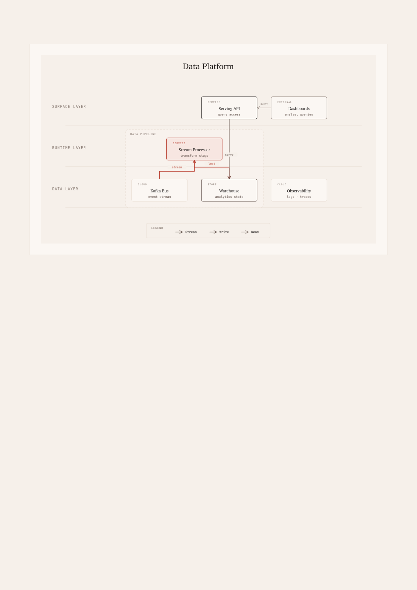</a><br>
      <b>Data Platform</b><br>
      策略化布局案例：用一套可复用 grammar 渲染管线主带、仓储服务和支撑读路径。
    </td>
  </tr>
  <tr>
    <td width="33.33%" valign="top">
      <a href="assets/demos/demo-uml-class.pdf">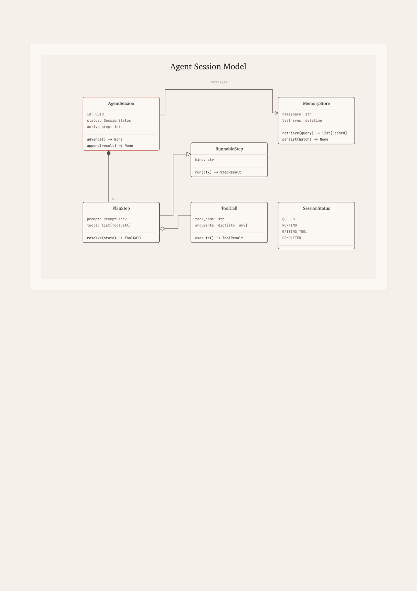</a><br>
      <b>Agent Session Model</b><br>
      UML 领域模型案例：覆盖接口、枚举生命周期、组合、聚合，以及检索记忆关联。
    </td>
  </tr>
</table>

## 从输入到输出

1. 从原始内容、草稿、笔记、来源链接，或一句像 `帮我做一份一页纸` 这样的请求开始。
2. Folio 先判断合适的文档类型和语言路径，再把内容蒸馏成模板可承接的结构。
3. 最终输出稳定的 PDF 或 PPTX，保留 Folio 的暖纸底、serif 层级和克制朱红焦点。
4. 如果请求的是独立架构图或 UML 类图，也可以直接落成可复用的 `SVG + PNG + PDF` artifact。

## 快速开始

**CLI**

使用 `scripts/folio.py` 作为稳定的项目入口：

```bash
python3 scripts/folio.py doctor
python3 scripts/folio.py list-targets
python3 scripts/folio.py check
python3 scripts/folio.py build resume-en
python3 scripts/folio.py verify resume-en
python3 scripts/folio.py package
```

新机器上先运行 `doctor`。它会检查 WeasyPrint 原生库、PDF 工具、图形导出工具、PPTX 支持和中文字体是否就绪，避免把环境问题误判成模板问题。

**Claude Desktop**

构建或直接使用 `dist/folio.zip`，打开 Customize > Skills > "+" > Create skill，然后直接上传 ZIP。

**通用 agent 环境**（Codex、OpenCode、Pi，以及其他读取 `~/.agents/` 的工具）

可以先用打包好的 ZIP 本地安装；如果后续要发布，再把仓库放到你自己的命名空间下。

Folio 会根据自然语言请求自动触发。你只需要尽量把下面这些信息讲清楚：

- 想要的文档类型
- 使用的语言
- 原始内容、笔记、草稿或素材
- 必须保留的事实、数字或来源链接
- 相关品牌素材：logo、截图、产品图、品牌色
- 会影响输出的额外要求：PDF、PPTX、PNG、对外稿、内部备忘录

示例提示词：

- `帮我做一份一页纸`
- `帮我排版一份长文档`
- `帮我写一封正式信件`
- `帮我做一份作品集`
- `帮我做一份简历`
- `帮我做一套演讲幻灯片`
- `帮我写一份英伟达个股研报`
- `帮我整理更新日志`
- `帮我生成一张系统架构图`
- `帮我画一张 UML 类图`
- `帮我把这份报告设计成网页阅读页`
- `帮我设计一个 Folio 风格的产品工作台`

可选：创建 `~/.config/folio/brand.md`，持久保存身份信息、文档默认设置和写作习惯。可从 [brand.example.md](references/brand.example.md) 开始。当前请求存在歧义时，Folio 会把它作为 fallback 上下文使用。

模板位于 `assets/templates/`。`assets/demos/` 只保留渲染后的 `PDF + PNG` 展示资产，这样 README 可以直接展示真实成品，而不是在 Markdown 里重复实现首页的布局逻辑。

## 核心能力

### 类型路由

Folio 会在 8 种文档类型和 2 条语言路径之间自动路由。

- 中文请求路由到 `*.html` 或 `slides.py`
- 英文请求路由到 `*-en.html` 或 `slides-en.py`
- Slides 的源模板是 Python，不是 HTML

### 内容蒸馏

Folio 不要求输入必须先整理成干净提纲，也能把原始材料收束成成型文档。

- 会议笔记、信息 dump、聊天记录、散乱 bullet 都可以蒸馏成适配模板的结构
- 简历和作品集会被收紧到更强调可量化结果的写法
- 研报和更新日志会被推向证据优先的写法，而不是泛泛总结

### 来源与素材检查

Folio 把“当前事实”和“品牌素材”当作一等输入，而不是补充信息。

- 涉及当前事实时，默认先看可靠来源再写
- 涉及品牌文档时，会检查 logo、截图、产品图和品牌色是否齐备
- 如果关键素材缺失，应明确标出缺口，而不是用泛化视觉凑数

### Web 设计指导

Folio 可以指导浏览器页面设计，同时保持现有静态文档构建链不变。

每个 Web 请求都先建立设计合同，再进入 layout、mockup 或代码：

| 步骤 | 必须决策 | 可见结果 |
|---|---|---|
| 1 | page job、archetype、primary object 和 orientation | 第一屏说明页面要解决什么问题 |
| 2 | content plan 和 page skeleton | 先命名 Reading、Workspace 或 Hybrid 区域，再考虑组件 |
| 3 | required states 和 motion thesis | loading、empty、error、selected、success 状态有语义动效 |
| 4 | mobile collapse plan 和 final quality gate | 窄屏不依赖 hover 或只存在于桌面的隐藏控制 |

页面骨架替代组件展台：

- Reading：opening block / contents rail / article body / figure band / source notes
- Workspace：nav / toolbar / primary work area / inspector / feedback
- Hybrid：reading rail / document preview / operation panel / status
- Web 设计指导是给 agent 使用的设计参考，不会新增 Web 应用构建链，也不会改变 Folio 的 PDF / PPTX / SVG 输出

Motion thesis 必须说明意义，而不是装饰：

| 层级 | 模板 |
|---|---|
| Page motion | `This motion means the user is oriented within the page by ...` |
| Region motion | `This motion means secondary context is attached to or removed from ...` |
| Object motion | `This motion means the current object, row, figure, source, or section is ...` |
| Control motion | `This motion means the control can be acted on, is being pressed, or has completed ...` |

只启用服务页面任务的层级。hover、active、focus 不能成为整套动效系统。

### 输出生成

Folio 目前支持两条主输出路径：

- HTML 模板 -> PDF
- Python 幻灯片模板 -> PPTX
- Diagram spec -> SVG + PNG + PDF

展示型 demo 通常会同时保留 `HTML + PDF + PNG`，这样首页和 README 才能持续反映真实状态。

### 基于 Cheatsheet 的快速编辑

Folio 不只是模板集合，还带了一份紧凑的操作参考：[CHEATSHEET.md](CHEATSHEET.md)。

- 需要最快路径时，看它拿 token、字号、间距、图表限制和常用 CSS 片段
- 需要完整视觉系统时，看 `references/design.md`
- 结构没问题但内容质量不够时，看 `references/writing.md`
- 构建、页数、渲染行为出问题时，看 `references/production.md`
- 指导浏览器页面设计时，看 `references/web-foundation.md`、`references/web-reading.md`、`references/web-workspace.md` 和 `references/web-checklist.md`

## 排版规则

这些是最值得守住的最低规则集。

1. 页面底色固定为 parchment `#F6F0EA`，不要用纯白。
2. 全文只保留一个强调色：cinnabar-coral `#B83D2E`。
3. 默认一页一套 serif，除非模板本身已经定义了其他视觉语言。
4. Serif 正文保持 400，标题保持 500，避免 synthetic bold。
5. 中文印刷正文通常带少量字距，英文正文保持 0。
6. Tag 背景必须使用实色 hex，不要用 `rgba()`，否则 WeasyPrint 可能渲染出双层矩形。
7. 层次感来自 ring shadow、whisper shadow 或明暗切换，不用硬投影。
8. 必须守住各文档类型的页数契约，尤其是简历和一页纸。

## 设计参考

先看短参考，需要时再深入。

- [CHEATSHEET.md](CHEATSHEET.md)：快速参考
- [references/design.md](references/design.md)：视觉系统
- [references/writing.md](references/writing.md)：内容策略与质量标准
- [references/production.md](references/production.md)：构建、验证与排障
- [references/diagrams.md](references/diagrams.md)：内联 SVG 图表规则
- [references/web-foundation.md](references/web-foundation.md)：阅读页面和产品工作台的 Web 设计指导基础

## 生图提示词

Folio 也可以作为图片模型或绘图工具的风格 brief。把 `references/` 交给它们，并明确要求遵守 Folio 的暖纸底色、朱红克制、serif 层级和编辑式留白。

示例插图 brief：

<table>
  <tr>
    <td width="33.33%" valign="top" align="center">
      <br>
      高山夜行列车旅行图册：站点注释、时刻卡片、暖纸底和手工批注并存
    </td>
    <td width="33.33%" valign="top" align="center">
      <br>
      海岸周末路线海报：潮汐时间窗、咖啡停靠点、步行段与换乘点清晰分层
    </td>
    <td width="33.33%" valign="top" align="center">
      <br>
      沙漠设计酒店旅行手账：到达地图、打包提示、物件特写与留白并置
    </td>
  </tr>
</table>

## 支持

- 如果发现 bug、措辞漂移或版式回归，欢迎提 issue 或 PR。
- 代码和模板使用 MIT License。
- LXGW WenKai 为开源字体；Charter 依赖系统或开源可用性。
