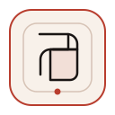

  

<h1 align="center">Folio Drawing DSL V4.1</h1>

Verified, accessible diagram embedding for documents and presentation decks.

### Changelog

1. Added explicit A4, Letter, responsive HTML, and 16:9 slide host contracts with bounded safe areas and contain-fit placement.
2. Added atomic HTML and PPTX embedding through named slots with content-addressed SVG and PNG artifacts.
3. Added portable source manifests that record fixture, artifact, compiler, profile, dimensions, placement, caption, and semantic data evidence.
4. Added exact accessible data tables for HTML and PDF charts and equivalent semantic data notes for presentation charts.
5. Added stale and tamper verification for source fixtures, artifacts, inline SVG, embedded images, captions, alt text, tables, and notes.
6. Replaced manual equity-report SVG extraction instructions and fixed slide image distortion while preserving existing compiler boundaries.
7. Added A4, Letter, Chinese, and seven-slide integration fixtures with complete PDF, PPTX, visual-baseline, and package release gates.

### 更新日志

1. 新增 A4、Letter、响应式 HTML 与 16:9 幻灯片宿主契约，统一安全区和等比适配规则。
2. 新增基于命名插槽的原子化 HTML 与 PPTX 嵌入流程，并使用内容寻址的 SVG 和 PNG 产物。
3. 新增可移植来源清单，记录输入、产物、编译器、Profile、尺寸、位置、图注和语义数据证据。
4. 为 HTML 与 PDF 图表增加精确的可访问数据表，并为演示文稿图表增加等价的语义数据备注。
5. 新增对输入、产物、内联 SVG、嵌入图片、图注、替代文本、表格和备注的过期与篡改校验。
6. 移除股票报告中的手工 SVG 提取流程，并修复幻灯片图片变形，同时保持既有编译边界不变。
7. 新增 A4、Letter、中文与七页幻灯片集成样例，并通过完整 PDF、PPTX、视觉基线与打包门禁。

> Folio is an editorial document and diagram design system for durable professional artifacts. https://github.com/taoquo/folio
